
<h1 align="center">的弹幕视频网站</h1>

## 简介
弹幕视频网站：角色分为管理员、用户；支持视频管理、商品信息管理、订单管理、用户登录注册、评论互动等功能，界面简洁，功能完善，便于用户体验与后台管理。    --计算机毕业设计源码；毕设源码；java毕业设计源码

## 联系方式

<h3 align="center">获取完整代码与数据库文件 + 微信：deepguan QQ: 86050149 QQ群: 783742310</h3>

<h3 align="center">可帮忙远程部署 包运行成功！提供远程部署、修改代码、设计文档指导、代码讲解等服务！</h3>

## 功能介绍（完整见运行截图）
管理员：基本功能包括用户管理、视频信息管理、商品信息管理和订单管理。网站首页展示主导航栏与视频推荐信息。视频管理提供上传、编辑和删除功能。商品管理可以查看、修改、删除商品信息，并支持订单查询与管理。

用户：支持用户登录和注册功能。可以通过导航栏访问首页、视频和商品信息、论坛等模块。用户中心允许查看和编辑个人信息，包括用户名、密码、联系方式等。订单页面展示订单状态及详情，用户可进行订单管理和支付操作。

游客：可以浏览首页、视频信息和商品信息，查看视频播放区域的视频内容以及相关简介。访问视频的评论功能和商品详情信息。此外，论坛中心也开放给游客，允许查看帖子内容。

系统：提供基本的用户身份验证功能，包括管理员和普通用户的身份选择。信息保存功能提示用户保存用户名和密码。系统界面倡导简洁，把登录、导航、视频与商品管理等功能直观展示。

## 运行截图

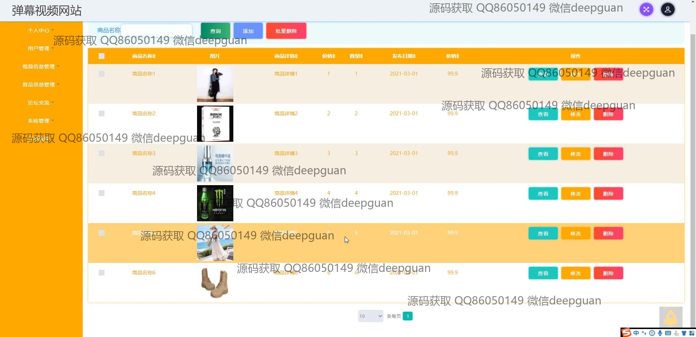
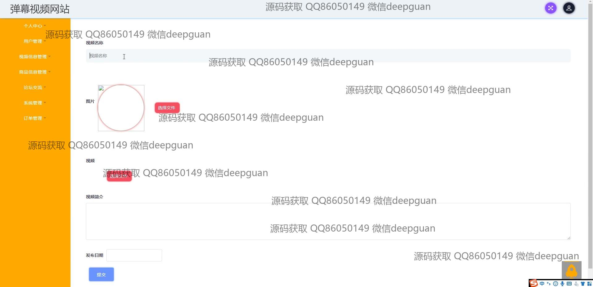
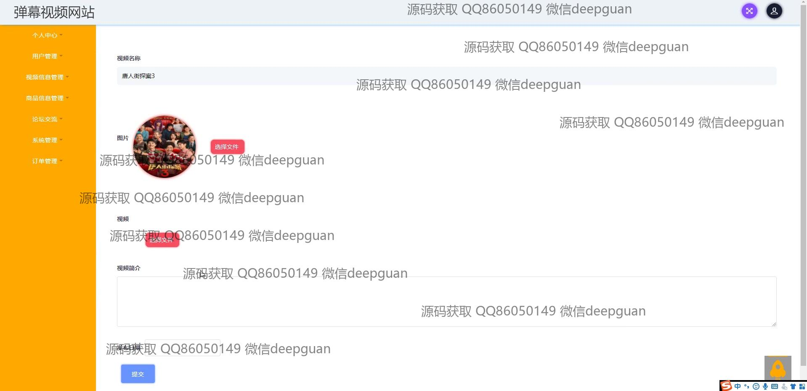
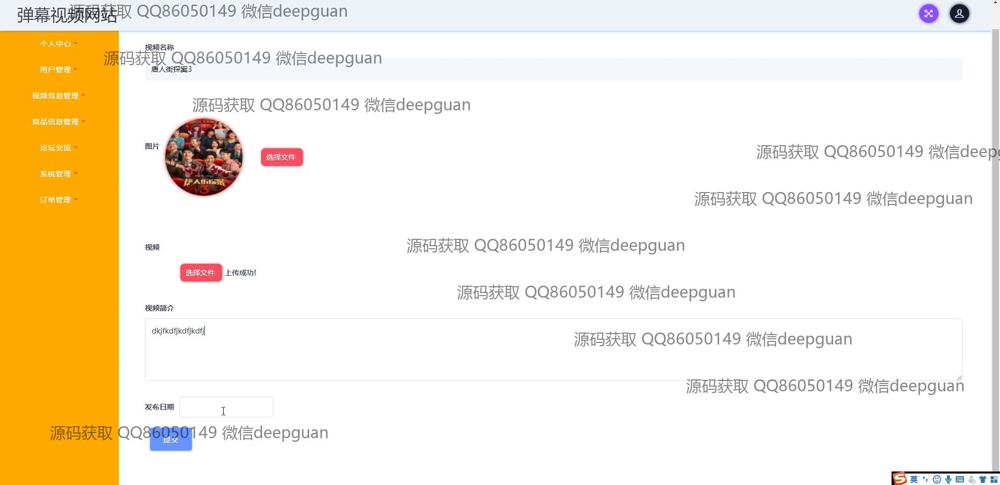
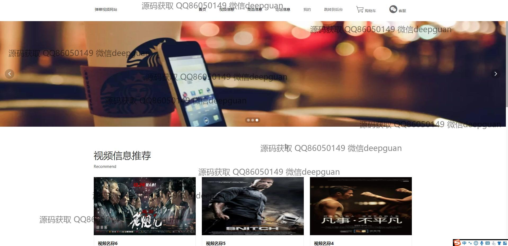
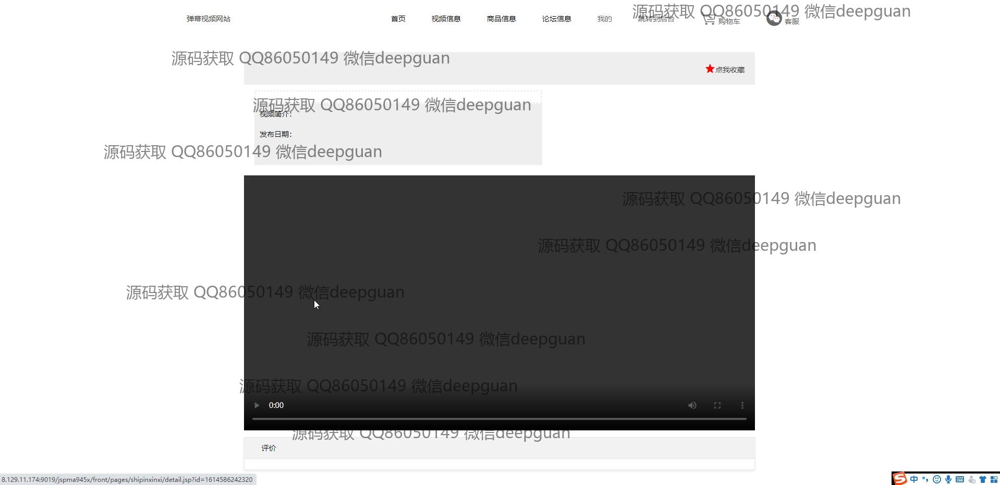

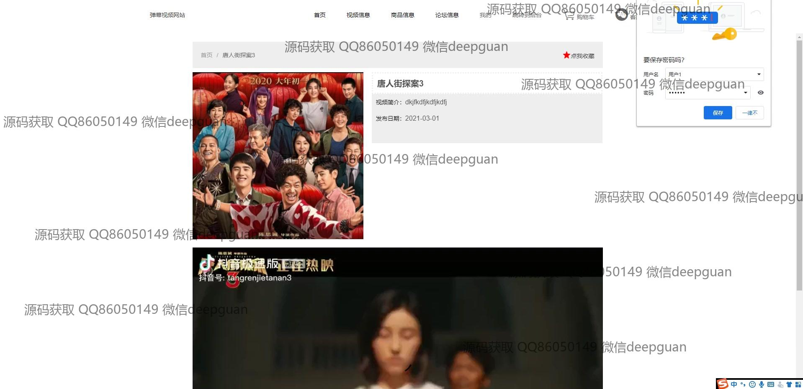
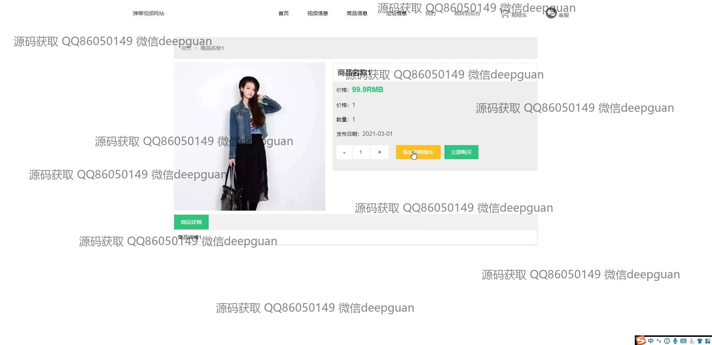
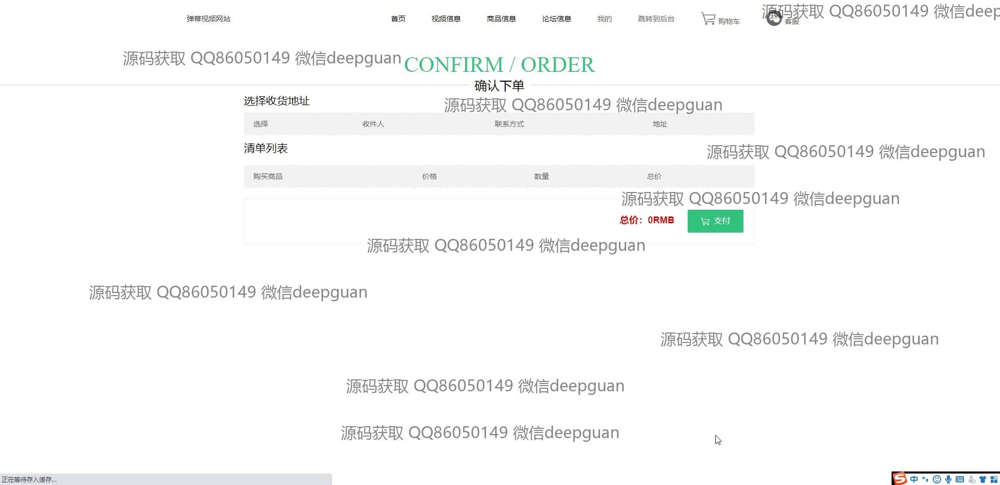

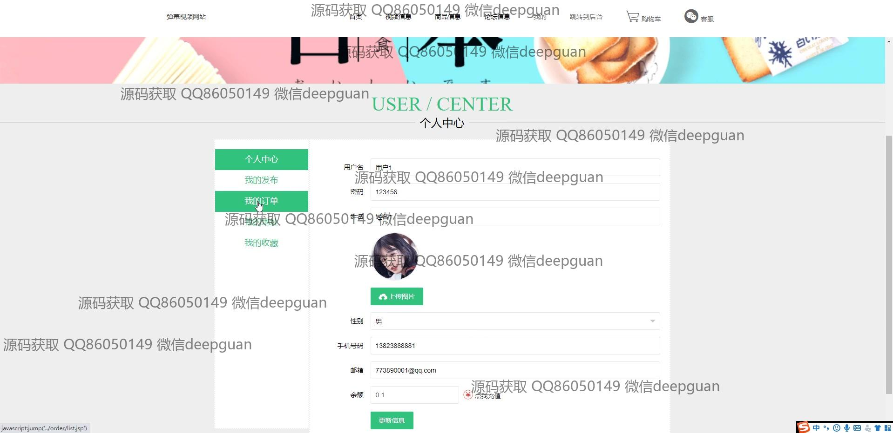

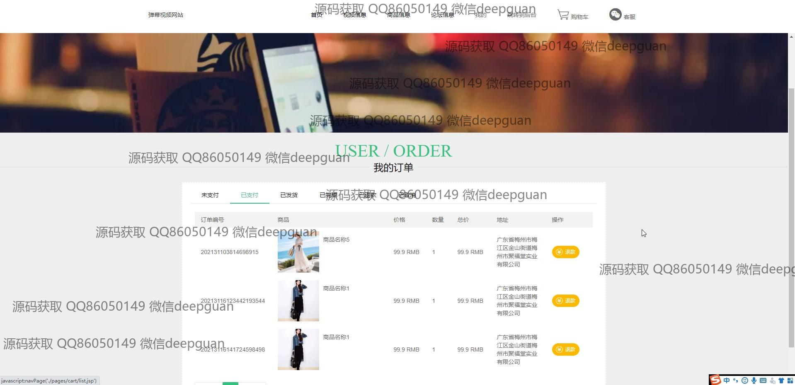
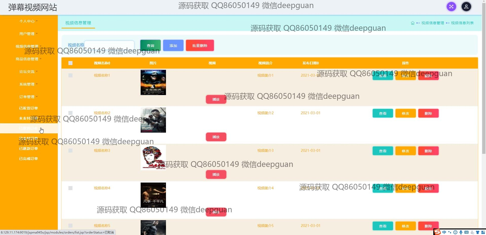
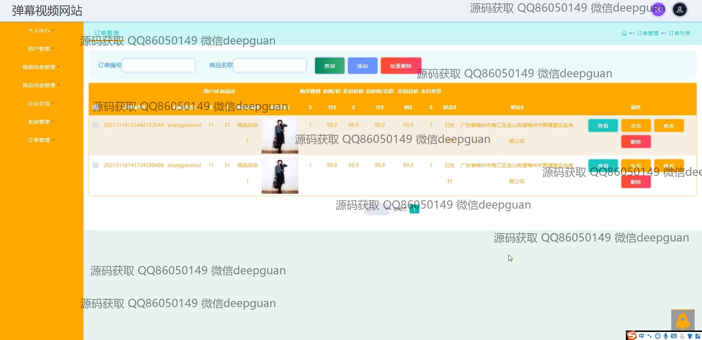
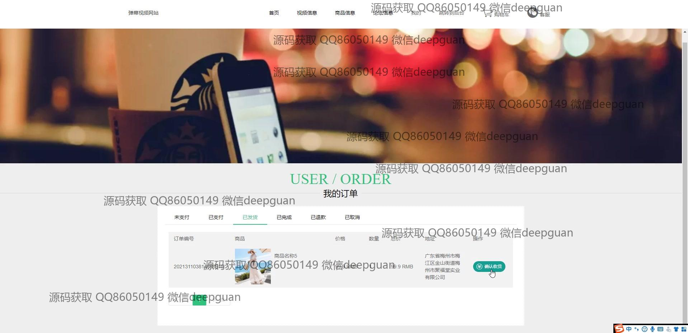
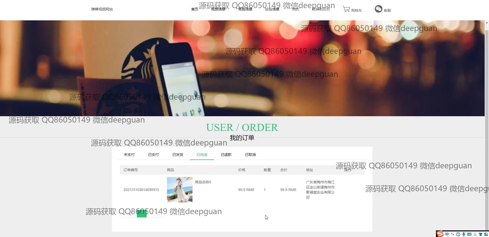
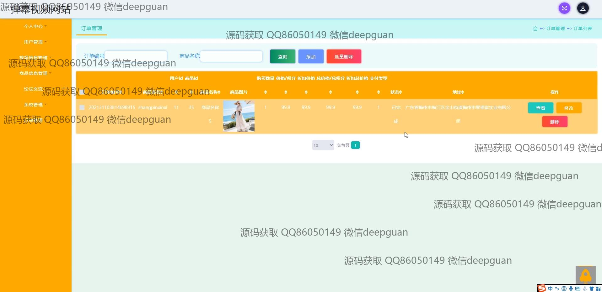

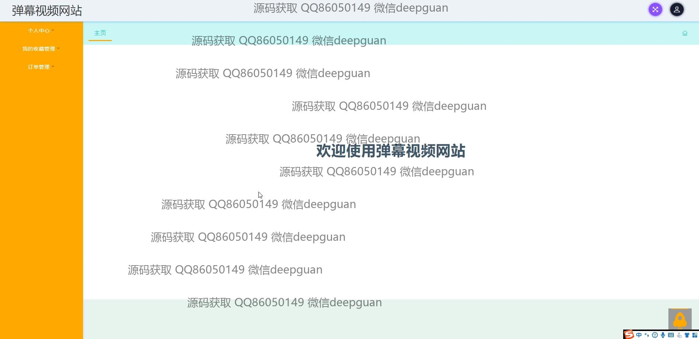
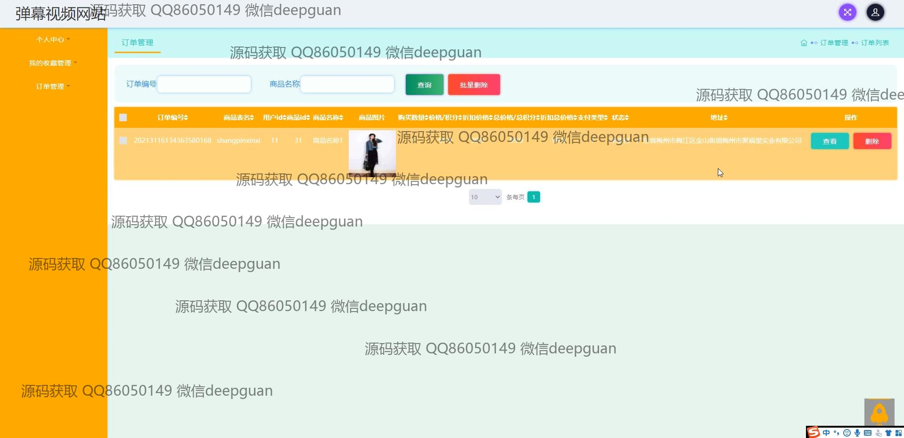

本代码来源于网络,仅供学习参考使用!

